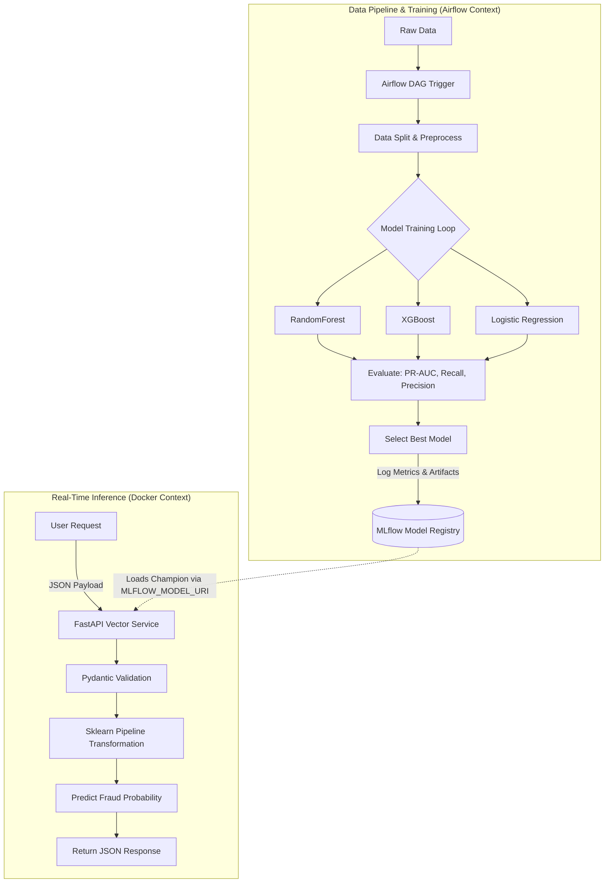

# Credit Card Fraud Detection MLOps

This repository contains a production-ready, end-to-end Machine Learning Operations (MLOps) pipeline for detecting credit card fraud. It is designed to act as a robust blueprint for handling extreme class imbalance within a scalable deployment architecture.

## 1. Project Overview & Problem Framing

Detecting credit card fraud is an inherently imbalanced binary classification problem. While standard ML algorithms excel at finding general patterns, they naturally struggle when the positive class (fraud) is incredibly rare. 

In this dataset:
- **Total Transactions:** 284,807
- **Fraud Cases:** 492
- **Base Rate:** ~0.173%

If a naive model simply predicts "Not Fraud" for every transaction, it will be **99.827% accurate**. This necessitates specialized preprocessing, algorithm tuning, and evaluation metrics tracking to build a genuinely useful system.

## 2. Dataset Description

The core dataset (`creditcard.csv`) consists of 31 features:
- `Time`: Seconds elapsed since the first transaction.
- `V1` to `V28`: Anonymized numerical features produced by a Principal Component Analysis (PCA) transformation to protect user privacy.
- `Amount`: The raw transaction amount (highly right-skewed, ranging from $0 to $25k).
- `Class`: The target variable (1 = Fraud, 0 = Non-Fraud).

## 3. Architecture & Project Structure

The platform implements a separation of concerns across Data Engineering, Model Training, and Inference Serving.

```markdown
fraud-mlops/
├── app/                  # FastAPI inference service and logic
├── src/                  # Core ML logic (loading, prep, train, eval, select)
├── pipelines/            # Airflow DAG for orchestration
├── tests/                # Pytest coverage suites
├── requirements/         # Segregated dependencies (api, train, orchestration, dev)
├── Dockerfile.api        # Lightweight API container definition
├── docker-compose.yml    # Local multi-container spin-up
└── README.md             # Architecture documentation
```

### 3.1 Pipeline Flow



1. **Airflow Orchestrator** triggers the data ingestion and preprocessing.
2. The pipeline trains **multiple candidate models**.
3. It evaluates them against **fraud-specific metrics**.
4. A **Best model is selected** based on strict business logic constraints.
5. All artifacts are pushed into an **MLflow Model Registry**.
6. The **FastAPI Inference Container** loads the "champion" model dynamically from MLflow on startup.

## 4. Engineering Choices

### Preprocessing Strategy
- **Why it matters:** Inconsistent scaling between training notebooks and production APIs is the #1 cause of silent model degradation.
- **The Approach:** We use an `sklearn.compose.ColumnTransformer`. 
  - `Amount` is transformed using `RobustScaler` to limit the massive distortion caused by multi-thousand dollar outliers.
  - `Time` is transformed into a cyclical "Hour of Day" feature (`(Time % 86400) / 3600`), then scaled via `RobustScaler`.
  - The `V1-V28` features pass-through (already scaled via PCA).
- **Inference safety:** The whole preprocessing pipeline is attached *to* the model under a unified `Pipeline` and saved as one MLflow artifact.

### Class Imbalance Handling
- Rather than immediately reaching for aggressive synthetic oversampling like SMOTE (which is prone to overfitting and introduces serving complexity), we rely on algorithmic constraints.
- We implement `class_weight="balanced"` within Logistic Regression and Random Forest.
- For XGBoost, we compute `scale_pos_weight = count(negative) / count(positive) ~ 577` to explicitly penalize the loss function heavily for missing fraud instances.

### Evaluation Metrics
We completely ignore global Accuracy.
- **Precision-Recall AUC (PR-AUC):** The gold standard for extreme imbalance. It measures how gracefully Precision falls as Recall rises.
- **Recall:** Crucial for fraud detection. Missing a true fraud has a massive financial penalty.
- **Precision:** Important for operational load. If precision is 1%, the fraud investigation team will suffer from alert fatigue because 99% of flags are legitimate customers.

### Best Model Selection Logic
We do not blindly pick the model with the highest metric. We implement a specific selection ruleset (`src/model_selection.py`):
1. **Constraints:** The model *must* achieve `Recall > 0.75` and `Precision > 0.80`.
2. **Tie-Breaker:** Out of the models that pass those constraints, we select the one with the highest `PR-AUC`.

## 5. Experiment Tracking with MLflow
- **Why MLflow:** Running `model.fit()` in a Jupyter Notebook and saving an opaque `.pkl` file creates "black box" deployments with no lineage.
- **Implementation:** Every candidate model creates a nested MLflow run under a parent pipeline run. We log hyperparameters, metrics, algorithm identity, and an explicit Confusion Matrix PNG artifact.
- **Source of Truth:** The API service mounts the MLflow store logic via `MLFLOW_MODEL_URI` and loads the best pipeline directly. You deploy new models by pointing to a new URI, rather than copying binaries.

## 6. Real-Time Serving (FastAPI & Docker)
- **FastAPI:** Exposes a JSON REST interface (`/predict`).
- **Pydantic Validation:** Inputs are rigorously validated to block incorrect types or missing data payloads. Bad data hitting `sklearn` models deep inside an API causes ungraceful crashes.
- **Dockerization:** We split `requirements.txt`. The `Dockerfile.api` installs *only* what it needs to serve inferences (Pandas, Sklearn, FastAPI). It specifically excludes Airflow and training dependencies (like Matplotlib) to ensure tiny image footprints and reduced attack surfaces.

## 7. How to Run Locally

### 1. Prerequisites
Ensure you have Docker and Python 3.10+ installed.

### 2. Environment Setup
Create a virtual environment:
```bash
python -m venv venv
# Windows:
.\venv\Scripts\activate
# Unix:
source venv/bin/activate
```
Install DEV requirements to test:
```bash
pip install -r requirements/dev.txt
pip install -r requirements/train.txt
pip install -r requirements/api.txt
```

### 3. Run the Training Pipeline
To train multiple models and populate your MLflow registry:
```bash
# Recommendation for Windows (bypasses Airflow compatibility):
python run_pipeline.py

# To run via Airflow (for production/WSL/Linux):
python -c "from pipelines.training_pipeline import run_training_pipeline; run_training_pipeline(ti=type('obj', (object,), {'xcom_push' : lambda **kwargs: None})())"
```
This logs everything into a local `./mlruns` directory.

### 4. Windows Visual Orchestrator (Dashboard)
Since Airflow is native to Linux/Docker, use the included **MLOps Dashboard** for a visual experience on Windows:
```bash
streamlit run dashboard.py
```
This dashboard visualizes your DAG, allows triggering a training run, and displays live MLflow metrics.

---

## 🛠️ Advanced: Running Official Airflow UI on Windows
If you want the authentic Airflow experience without Docker, you must use **WSL2 (Windows Subsystem for Linux)**:

1. **Install WSL2:** In PowerShell (Admin), run `wsl --install`. Restart Windows.
2. **Setup Ubuntu:** Open "Ubuntu" from the start menu.
3. **Install Airflow:**
   ```bash
   sudo apt update && sudo apt install python3-pip python3-venv -y
   python3 -m venv venv && source venv/bin/activate
   pip install apache-airflow
   airflow db init
   airflow webserver --port 8080
   ```
4. **Access:** Open `http://localhost:8080` in your Windows browser.

### 4. Boot the Microservices
Start the API and the internal MLflow UI:
```bash
docker-compose up --build
```
API is available at `http://localhost:8000/docs` 
MLflow is available at `http://localhost:5000`

### 5. Running Tests
In another terminal, simply invoke pytest:
```bash
pytest tests/ -v
```

## 8. Limitations & Future Improvements
1. **Model Drift Monitoring:** Currently missing tracking for feature distribution drift over time.
2. **Feature Store:** `Time` and historical aggregate data (e.g., "how many times has this card been used in 24 hours") are better served by a centralized Redis feature store.
3. **Airflow Deployment:** The provided DAG is local/blueprint-style. In a real environment, it would exist inside a dedicated Kubernetes/MWAA cluster triggering isolated remote batch training endpoints.

## 9. Interview Narrative Focus
If discussing this project, highlight:
- The rejection of naive metrics (Accuracy).
- The transition from notebook-based `.pkl` files to a secure MLflow model registry mapping.
- The insistence on splitting dependencies so the REST API Docker image remains highly optimized.
- The use of strict Pydantic schemas to validate incoming transactional JSON prior to touching DataFrames. 
